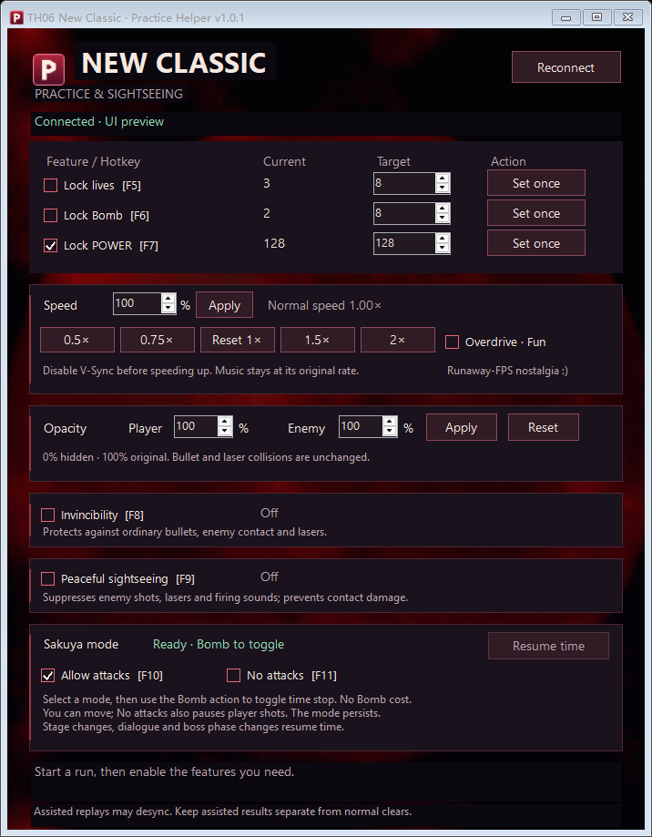

# TH06 New Classic Practice Helper

An unofficial Windows x64 practice and sightseeing helper. Features start disabled. Developed with AI assistance; not affiliated with the game developers or thprac.

## Download

[Download the current release](https://github.com/sky1641/th06nc-practice/releases/latest)

Choose the self-contained ZIP if you do not have .NET 9 Desktop Runtime x64. Extract all files before launching. You do not need to download or build the source code to use the helper.

## Interface



Interface preview; the native window frame can differ with Windows settings.

## Documentation

- [English guide](docs/en/README.md)
- [中文使用说明](docs/zh-CN/README.md)
- [Build and test](docs/development/README.md)

Keep assisted scores and replays separate from normal clears. Read the guide for the supported game build and limitations.

## Repository

```text
src/        Application source and project
tests/      Regression tests
assets/     Background and icon
docs/       User guides, previews and development notes
scripts/    Build, package and test scripts
.github/    Build verification
```
